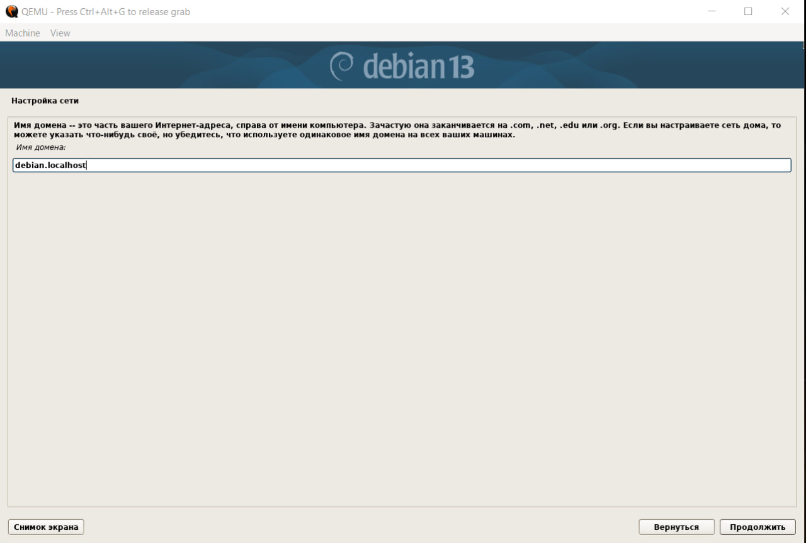
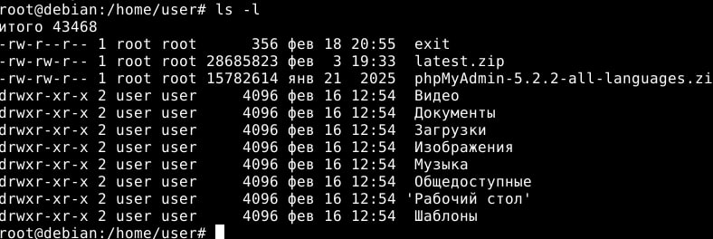

# Лабораторная работа N2 ()

## Выполнил

- Фамилия Имя:Klincev Andrei
- Группа: IA2403
- 18.02.2026

## Подготовка сервера

1. Установка виртуальной машины и скачаивание образа системы. Необходимо было установить на своё устройство вирутальную машину (гипервизор) *QUEMU* а также скачать [debian](https://www.debian.org/distrib/netinst) (для установки была выбранна версия "Маленькие диски или USB-накопители" под процессор **amd64**).
2. В консоле в корневой папке "container02" был создан образ диска для виртульной манины, размером 8GB и в формате qcow2 ```qemu-img create -f qcow2 debian.qcow2 8G```
3. После создания образа устанвливаем его задав 2GB оперативной памяти для установки
   ```qemu-system-x86_64 -hda debian.qcow2 -cdrom dvd/debian.iso -boot d -m 2G```
4. Устанавливаем debian с параметрами
   1. Имя компьютера: debian;
   2. Хостовое имя: debian.localhost; 
   3. Имя пользователя: user;
   4. Пароль пользователя: password;
5. Перезапускаем debian используя команду ```qemu-system-x86_64 -hda debian.qcow2 -m 2G -smp 2 -device e1000,netdev=net0 -netdev user,id=net0,hostfwd=tcp::1080-:80,hostfwd=tcp::1022-:22```
   - ```qemu-system-x86_64``` - запускаем QEMU для виртуальной машины с архитектурой x86_64
   - ```-hda debian.qcow2``` - задаём виртуальный жёсткий диск
   - ```debian.qcow2``` - файл виртуального диска, который будет использоваться как основной диск гипервизора
   - ```-m 2G``` - задаём объём ОЗУ в 2 GB
   - ```-smp 2``` - количество вертуальных ядер процессора
   - ```-device e1000,netdev=net0``` - подключаем вертальную сетевую карту
   - ```-netdev user,id=net0,hostfwd=tcp::1080-:80,hostfwd=tcp::1022-:22``` - создаём сетевой интерефейс а также перенаправляем порты виртуальной для виртуальной машины
6. Устанавливаем LAMP - стек технологий для веб-серверов и приложений. (Linux, Apache, MariaDB, PHP).
   1. Переходим в супер пользователя ```su```
   2. Обновляем список пакетов ```atp update -y```
   3. Уставнавливаем программы из репозитория debian ```apt install -y apache2 php libapache2-mod-php php-mysql mariadb-server mariadb-client unzip```
       - ```apache2``` - веб серевер который принимает http запросы браузера и отдаёт страницы
       - ```php``` - нужен для работы сетевой логики
       - ```libapache2-mod-php``` - модуль Apache, позволяет запускать php скрипты внутри веб сервера
       - ```php-mysql``` - расширение php для работы с браузером
       - ```mariadb-server``` - сервер баз данных
       - ```mariadv-client``` - клиент для работы с mariadb. Позволяет подклчиться к базе данных и выполнять sql запросы
       - ```unzip``` - утилита для распакаови .zip
7. Скачевам СУБД PhpMyAdmin используя команду ```wget https://files.phpmyadmin.net/phpMyAdmin/5.2.2/phpMyAdmin-5.2.2-all-languages.zip```
8. Скачиваем wordpress ```wget https://wordpress.org/latest.zip```
   >Команда ```wget``` позволяет скачать данные по протаколу http. В данном случае происходит скачивание архивов
9. Проверяем наличие скаченных архивов используя команду ```ls -l```
10. Распаковываем скаченные архивы
    1. ```mkdir var/www``` создаём папку ```www``` в каталоге ```var```
    2. Распаковываем архив с *phpMyAdmin* ```unzip phpMyAdmin-5.2.2-all-languages.zip```
    3. Архив распоковался в корневой деррикторий, его необходимо переместить в ```mkdir var/www/phpmyadmin```, для этого используем команду ```mv phpMyAdmin-5.2.2-all-languages /var/www/phpmyadmin```
    4. Пункты 2-3 повторяем и для файла ```latest.zip```, в котором располагается wordpress. В качестве финального каталога будет папка ```var/www/wordpress```
    > P.S. также можно было разархивировать файлы сразу в нужные папки ```unzip phpMyAdmin-5.2.2-all-languages -d /var/www/phpmyadmin```
11. Создаём новую базу данных
    1. Пытаемся подключиться к SQL серверу под пользователем **root** ```mysql -u root```
    2. Создаём базу данных под названием ```wordpress_db``` ```CREATE DATABASE wordpress_db;```
    3. затем пользователя ```CREATE USER 'user'@'localhost' IDENTIFIED BY 'password';```
    4. Даём нашему пользователю всю власть наб базой данных ```GRANT ALL PRIVILEGES ON wordpress_db.* TO 'user'@'localhost'```
    5. Обновляем таблицу парав пользователей дабы сообщить о новом владыке нашей базе данных ```FLUSH PRIVILEGES;```
    6. Выходим из базы данных ```EXIT;```
12. Настраиваем конфигурацию для phpmyadmin
    1. Создаём файл в каталоге при помощи ```nano /etc/apache2/sites-available/01-phpmyadmin.conf```. ```nano``` - тектовый редактор для создания/редактирования файлов
    2. Невнимательно вписываем параметры для виртуального соедеинения, а потом несколько раз переписываем при помощи того же редактора ```nano``` .

    ```php
    <VirtualHost *:80>
      ServerAdmin webmaster@localhost
      DocumentRoot "/var/www/phpmyadmin"
      ServerName phpmyadmin.localhost
      ServerAlias www.phpmyadmin.localhost
      ErrorLog "/var/log/apache2/phpmyadmin.localhost-error.log"
      CustomLog "/var/log/apache2/phpmyadmin.localhost-access.log" common
    </VirtualHost>
    ```

13. Настраиваем конфигурацию для wordpress
    1. Создаём файл конфигурации в том же каталоге что и для ```phpmyadmin```:  ```nano /etc/apache2/sites-available/02-wordpress.conf```
    2. Всё также невнимательно вписываем параметры и несколько раз переписываем

      ```php
      <VirtualHost *:80>
         ServerAdmin webmaster@localhost
         DocumentRoot "/var/www/wordpress"
         ServerName wordpress.localhost
         ServerAlias www.wordpress.localhost
         ErrorLog "/var/log/apache2/wordpress.localhost-error.log"
         CustomLog "/var/log/apache2/wordpress.localhost-access.log" common
      </VirtualHost>
      ```

14. Регестрируем конфигурации исполняя команды
    1.  Регистрируем phpmyadmin ```/usr/sbin/a2ensite 01-phpmyadmin```
    2.  Регистрируем wordpress ```/usr/sbin/a2ensite 02-wordpress```
15. Добавляем в таблицу сответсвия доманных имён строки
    - ```127.0.0.1 phpmyadmin.localhost```
    - ```127.0.0.1 wordpress.localhost```

## Тестирование сервера

### Work in progress →

## ←To be continued
